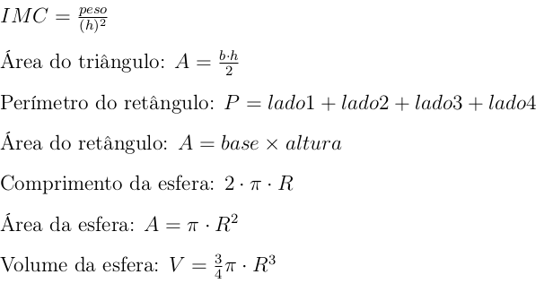

# EXERCÍCIOS DE APRENDIZADO 01

1. Construa um algoritmo que leia um número inteiro e depois de lido escreva o número.
2. Construa um algoritmo que leia o nome de uma pessoa e escreva o nome depois de lido.
3. Faça um algoritmo que leia o nome de uma pessoa e sua idade e escreva seu nome e sua idade.
4. Faça um algoritmo que leia o nome de uma pessoa e seu peso e escreva seu nome e seu peso.
5. Faça um algoritmo que leia o nome de uma pessoa, sua idade e seu peso e escreva uma frase com
o nome, a idade e o peso lidos.
6. Faça um algoritmo que leia o nome de duas pessoas e seus pesos e escreva uma frase para cada
pessoa com seu nome e peso.
7. Construa um algoritmo para ler dois números inteiros, somar os dois números e escrever o resultado
da soma.
8. Construa um algoritmo que calcule a média aritmética entre três idades quaisquer fornecidas pelo
usuário.
9. Construa um algoritmo que calcule a média ponderada de três notas com os pesos 2, 4, 6,
respectivamente.
10. Construa um algoritmo que leia dois números reais e faça a subtração do primeiro pelo segundo
escrevendo os números e o resultado da operação.
11. Construa um algoritmo que leia dois números reais e faça a multiplicação do primeiro pelo
segundo escrevendo os números e o resultado da operação.
12. Construa um algoritmo que leia três números inteiros e faça o seguinte: some os dois primeiros e
o resultado da soma subtraia do terceiro número. Escrever os números, o resultado da soma e o resultado
da subtração.
13. Construa um algoritmo que leia três números inteiros e faça o seguinte: multiplique os dois
primeiros e o resultado da multiplicação some com o terceiro número. Escrever os números, o resultado
da multiplicação e o resultado da soma.
14. Monte um algoritmo que leia o nome de três pessoas, suas alturas e suas idades. Depois, escreve
o nome das três pessoas, a média aritmética das alturas e das idades e a média geométrica das alturas e
das idades.
15. Faça um algoritmo que dado o lado de um triângulo e sua altura, ele calcula sua área. Depois,
escreve o valor do lado, da altura e a área.
16. Construa um algoritmo que leia o nome, o peso e a altura de cinco pessoas. Em seguida, ele
escreve o Índice de Massa Corporal (IMC) de cada um.
17. Construa um algoritmo que dado os lados de um retângulo calcule seu perímetro e depois sua
área. No final escreve os lados, seu perímetro e sua área.
18. Faça um algoritmo que leia nove números inteiros. Depois de lê-los, calcule a média aritmética
dos três primeiros, a média aritmética dos três números do meio e a média aritmética dos três últimos.
Por fim, calcule a média das três médias e escreva todos os números e todas as médias obtidas.

19. Faça um algoritmo para ler o raio e calcular o comprimento, a área e o volume de uma esfera.
Algumas informações úteis

